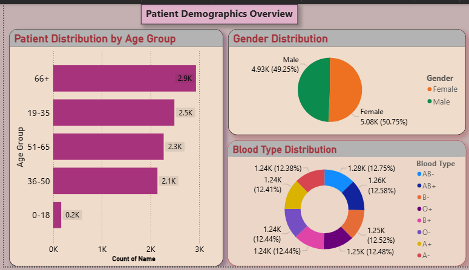
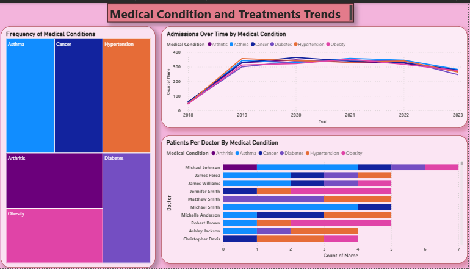
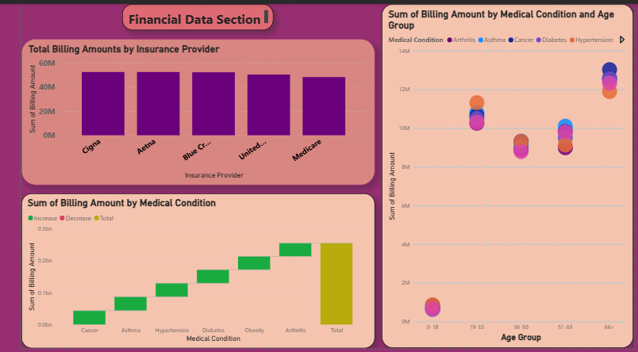
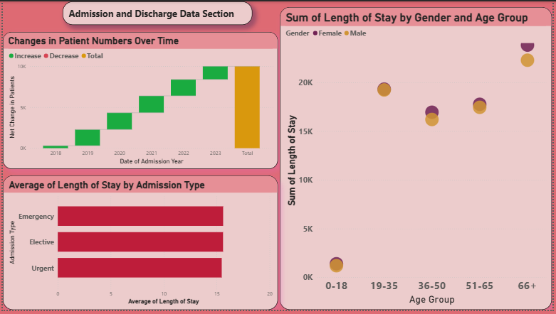

# 🏥 Healthcare Data Visualization (Power BI)

## 📌 Project Overview
This project focuses on analyzing healthcare data using Power BI to generate actionable insights related to patient demographics, medical conditions, financial performance, and hospital operations.

## 🎯 Objectives
- Analyze patient data
- Identify trends in medical conditions
- Evaluate hospital financial performance
- Support data-driven decision-making

## 🛠 Tools & Technologies
- Power BI
- DAX
- Data Visualization Techniques
- Healthcare Dataset (Kaggle)

## 📊 Key Dashboards

### 1. Patient Demographics
- Age distribution
- Gender analysis
- Blood group distribution

### 2. Medical Conditions
- Disease frequency
- Admission trends over time
- Patients per doctor

### 3. Financial Analysis
- Billing by insurance provider
- Revenue by medical condition

### 4. Hospital Operations
- Admission trends
- Length of stay analysis

## 📷 Dashboard Preview

## 📈 Key Insights
- Elderly patients (66+) dominate hospital visits
- Balanced distribution of medical conditions
- Revenue varies slightly across insurance providers
- Admission trends peaked around 2020

## 🚀 Future Improvements
- Add real-time data integration
- Apply machine learning for prediction
- Enhance dashboard interactivity

## 📄 Report
Full report available in this repository.

---
